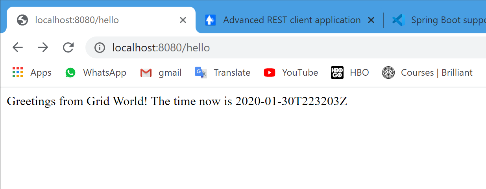
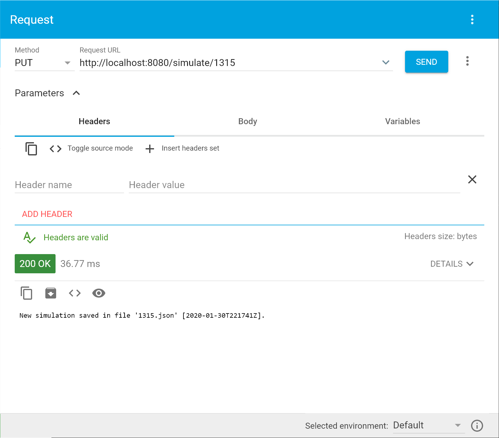

# GridWorld

## Java interview test project

Consider an infinite grid of white and black squares. The grid is initially all white and there is a machine in one cell facing right. It will move based on the following rules:

+ If the machine is in a white square, turn 90° clockwise and move forward 1 unit;
+ If the machine is in a black square, turn 90° counter-clockwise and move forward 1 unit;
+ At every move flip the color of the base square.

Implement an application that will receive HTTP PUT requests with a number of steps the simulation should run, always starting from the same conditions, and output the resulting grid to a file.

Please provide support documentation.

## Deliverable

The solution to the test project has been developed in Java using Visual Studio Code (VS Code). Since Java is not my main skill I decided to take the path of least resistance and used what I know works: Visual Studio Code for coding and debugging, and Docker for deployment.

### Build and Debug

To build and debug you need to open the GridWorld workspace in VS Code (assuming the current directory is GridWorld):

    cmd> code .

Once VS Code opens you can launch the web app under the debugger using F5.

To verify connectivity the GridWorld controller implements 2 methods:

    1. http://localhost:8080/hello which is a GET endpoint.
    2. http://localhost:8080/simulate/123 which is a PUT endpoint.

Use the GET endpoint to confirm web app works. It should respond with a timestamped greeting:

To call the PUT endpoint I used a Google Chrome browser extension [Advanced REST Client](https://restforchrome.blogspot.com/?utm_source=ARC&utm_medium=InsideApplication&utm_campaign=About). The response should report if the output file for the simulation has been created or if it existed already:

### Deploy

Since my workstation does not have a running webserver I decided to package and deploy the GridWorld web app using Docker. The project's Dockerfile builds the image. Before you can do that you have to force the jar package to be created. In the GridWorld directory issue the following commands:

    cmd> mvn package    # Required Apache Maven to be installed

After this is done the Docker image can be built:

    cmd> docker build . -t gridworld1

After the images has been built you can start the container:

    cmd> docker run -it -p 8080:8080 -d gridworld1

This spins up the container instance and we can execute the two (GET, PUT) endpoint methods mentioned above.
